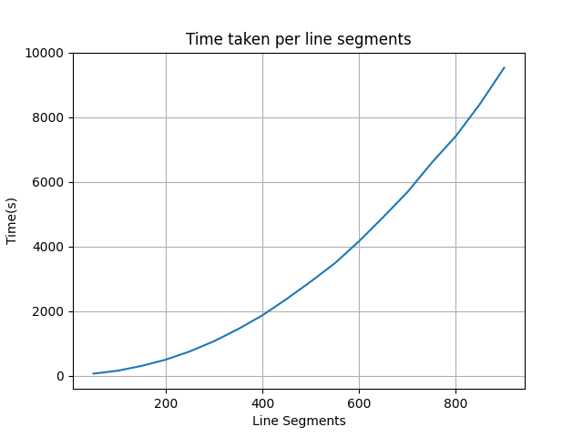

# General Information
This work is implemented under the scope of H2020 PlAtform for PrivAcY-preserving data Analytics (PAPAYA) project and the full version of this work is presented by Beyza Bozdemir¹, Sébastien Canard², Orhan Ermis¹, Helen Möllering³, Melek Önen¹, and Thomas Schneider³. ([¹EURECOM](https://www.eurecom.fr/); [²Applied Cryptography Group, Orange Labs](https://crypto.orange-labs.fr/people/); [³ENCRYPTO, TU Darmstadt](https://www.encrypto.cs.tu-darmstadt.de/home_page/index.en.jsp))
[In 16th ACM ASIA Conference on Computer and Communications Security (ACM ASIACCS 2021)](https://asiaccs2021.comp.polyu.edu.hk/). The full version of the study can be found in [this link](https://eprint.iacr.org/2021/612).

# Build containers
In  Order  to  build  the  containers,  make  sure  docker  is  installed  and place yourself in the folder containing the 3 Dockerfiles (client_Dockerfile, server1_Dockerfile, server2_Dockerfile).  
Then run the following commands
## Build Client
```
sudo docker build -t pp-traclus-client -f client_Dockerfile .
```
## Build Server 1
```
sudo docker build -t pp-traclus-server1 -f server1_Dockerfile .
```
## Build Server 2
```
sudo docker build -t pp-traclus-server2 -f server2_Dockerfile .
```
# Run Locally
After building the containers successfully, you have the option to run them locally.
## Run Client
```
sudo docker run -p 5002:5555 -it --rm pp-traclus-client
```
## Run Server 1
```
sudo docker run -p 5005:5555 -it --rm pp-traclus-server1
```
## Run Server 2
```
sudo docker run -p 5010:5555 -it --rm pp-traclus-server2
```

<!--- # Push to IBM
Or you can push them to the IBM clouds.

## Client
```
sudo docker tag pp-traclus-client de.icr.io/papaya-de/pp-traclus-client:latest
sudo docker push de.icr.io/papaya-de/pp-traclus-client:latest
```
## Server 1
```
sudo docker tag pp-traclus-server1 de.icr.io/papaya-de/pp-traclus-server1:latest
sudo docker push de.icr.io/papaya-de/pp-traclus-server1:latest
```
## Server 2
```
sudo docker tag pp-traclus-server2 de.icr.io/papaya-de/pp-traclus-server2:latest
sudo docker push de.icr.io/papaya-de/pp-traclus-server2:latest
```

After activating the server1 and server2 on the papaya platform, we need to run the client locally.
```
sudo docker run -p 5002:5555 -it --rm pp-traclus-client
```
--->
# Initialize Server-side Components' parameters on the Client-side Component
Once we run the containers (either in client-server mode or two non-colluding servers mode), we can run clustering algorithm via using those containers.  

Prior to the executing the client 

Input:  
- DS: Dataset containing line segments. The dataset format should be (X1,X2,Y1,Y2) for each line, otherwise it won't be accepted.   
- EPS: Epsilon   
- MS: MinLns   
- E: Number Of line segments to cluster   
- IT: Number of iterations   

## Two Non-colluding Servers mode (Client/Server1/Server2)
```
curl http://0.0.0.0:5002/init0/SERVER1_IP/SERVER1_PORT/SERVER1_URL/SERVER2_IP/SERVER2_PORT/SERVER2_URL
```

## To use Client/Server mode
```
curl http://0.0.0.0:5002/init1/SERVER1_IP/SERVER1_PORT/SERVER1_URL
```


# Run Clustering
Then we can start the clustering, a python function will detect the used mode and either the servers are running locally or on the IBM clouds and adapt to it.
```
curl -F 'file=@DS' http://0.0.0.0:5002/start/E/MS/EPS/IT
```

### Example commands to execute clustering locally:

Open four different terminals (one for client, two for servers and the last one for sending servers' configurations and clustering parameters to the client). 

Please note that if you prefer to use client-server mode, then you do not need to open two different terminals since we will have only one server.

Apply steps above to build and run the client and servers. Then, in the fourth terminal run the following command to list the active docker processes:

```
$ docker ps
```

| CONTAINER ID | IMAGE              | COMMAND          | CREATED      | STATUS      | PORTS                  | NAMES           |
| ------------ | ------------------ | ---------------- | ------------ | ----------- | ---------------------- | --------------- |
| 4550bc4635e6 | pp-traclus-server2 | "python3 app.py" | 27 hours ago | Up 27 hours | 0.0.0.0:5010->5555/tcp | clever_bhabha   |
| 8d87ed64cf6c | pp-traclus-client  | "python3 app.py" | 27 hours ago | Up 27 hours | 0.0.0.0:5002->5555/tcp | priceless_haibt |
| 73096f7b91ef | pp-traclus-server1 | "python3 app.py" | 27 hours ago | Up 27 hours | 0.0.0.0:5005->5555/tcp | amazing_wright  |

Then check the IP addresses of the server containers. You can learn the IP address of a particular container by issuing the following command:

```
$ docker inspect [container-id]
```

In short, by following the example above,

```
$ docker inspect 73096f7b91ef // for Server 1
$ docker inspect 4550bc4635e6 // for Server 2
```

Then you can issue the following command to set server information on the client-side component:

```
$ curl http://0.0.0.0:5002/init0/172.17.0.2/9999/172.17.0.2:5555/172.17.0.4/9999/172.17.0.4:5555
```

In this example, we assume that the IP addresses (obtained from the _docker inspect_ command) of servers are 172.17.0.2 and 172.17.0.4 for Server 1 and Server 2, respectively.

Later, you can issue the following command to run the clustering. Please note that this may take couple of times to execute clustering.

```
$ cd H2020_papaya/papaya-pptraclus/data/
$ curl -F 'file=@example_route_cleaned.csv' http://0.0.0.0:5002/start/100/3/50000/2

```

# Benchmark

## Client/Server1 Running on Argentera

Dataset: lines_partitioned_test.csv
Epsilon : 4500000000
Minlns : 3

| Line Segments   | Time(1 iter)| RAM(1 iter) | Time(3 iter)| RAM(3 iter) |
|----------------:|:-----------:|:-----------:|:-----------:|:-----------:|
| 100             | 0:01:06     |  1.85GB     | 0:01:15     |  2GB        |
| 400             | 0:13:34     |  10.3GB     | 0:16:40     | 11GB        | 
| 1000            | 1:27:24     |    58GB     | 1:53:12     | 62GB        |


## Client/Server1/Server2 Running on Argentera/IBM/IBM

<p align="center">

</p>


| Line Segments   | Time(1 Iter)| 
|----------------:|:-----------:|
| 100             | 0:02:53     | 
| 400             | 0:34:17     | 
| 1000            | 3:30:35     |


